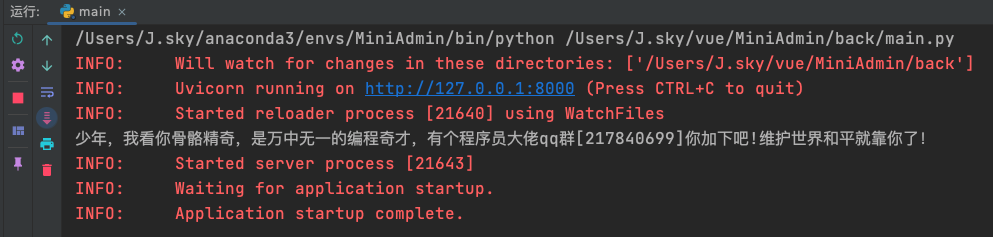
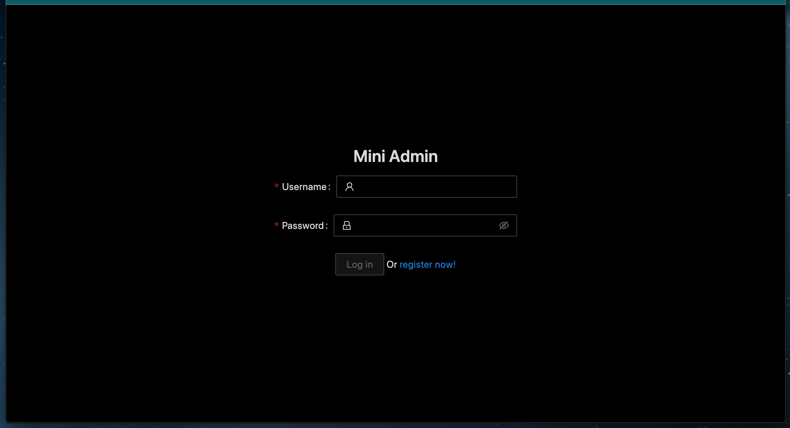
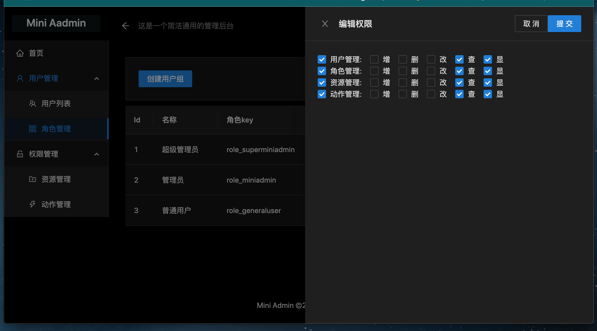
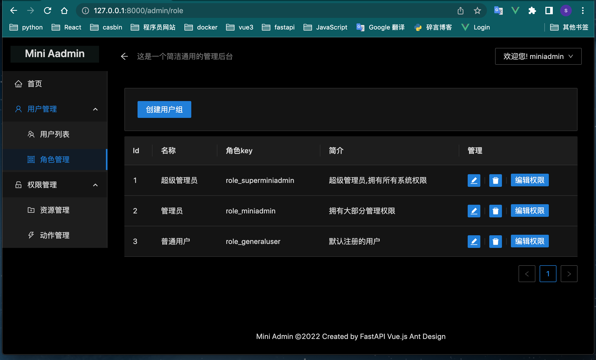
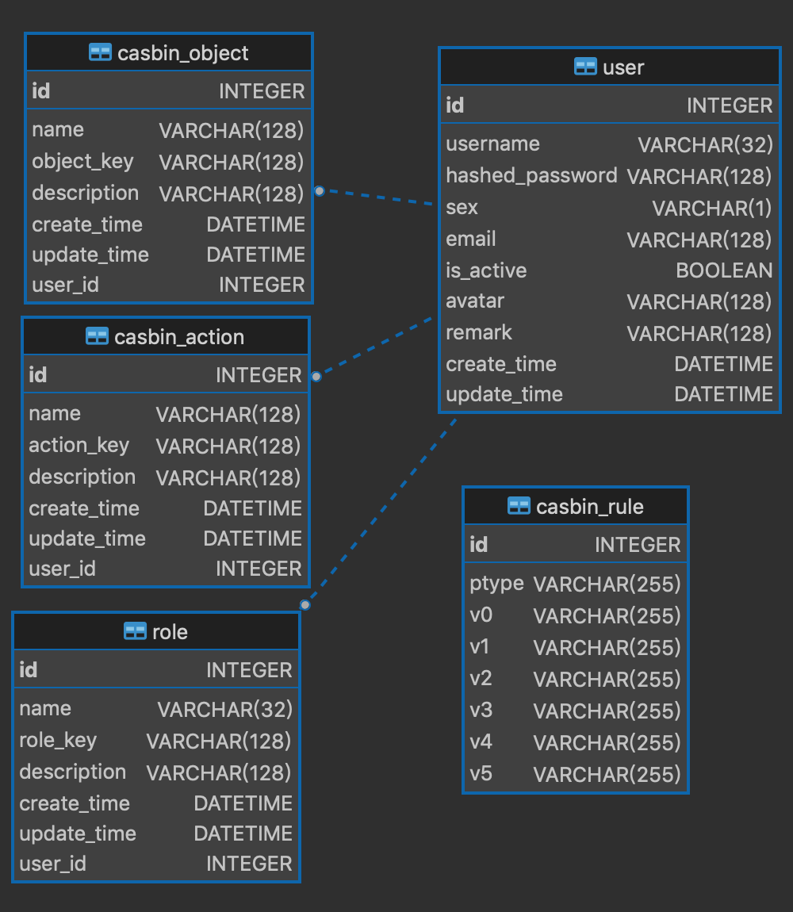

## Mini Admin

Mini Admin,一个简洁轻快的后台管理框架.支持拥有多用户组的RBAC管理后台 🚀

应用场景：2-5人的管理团队，需要管理的资源数目10个或是更少，如果想有一个简单轻快直接的后台管理，下载下来就可以使用，
不要配置各种运行环境，不要搭建各种服务器端的主机配置，就是想拿来就用！ 那么你就试试咱的MiniAdmin。

### 更新

 2023-03-04 更新一处权限数据组装错误。

### 安装 

Git克隆或是下载压缩包。

终端进入程序的根目录：

    pip install -r requirements.txt

然后：

    cd back
    python main.py

Uvicorn running on http://127.0.0.1:8000 (Press CTRL+C to quit)

初始的管理员：miniadmin 123456

效果图：

### 后端：

    casbin==1.17.4
    casbin_sqlalchemy_adapter==0.5.0
    fastapi==0.88.0
    jose==1.0.0
    loguru==0.6.0
    passlib==1.7.4
    pydantic==1.10.2
    pytest==7.1.2
    python_jose==3.3.0
    SQLAlchemy==1.4.39
    uvicorn==0.20.0

### 前端：

    "ant-design-vue": "^3.2.15",
    "axios": "^1.2.0",
    "vue": "^3.2.45",
    "vue-router": "^4.1.6"

### 数据库ER图：

后台的安全校验是基于Casbin(一个支持如ACL, RBAC, ABAC等访问模型)的授权库。
支持拥有多用户组的RBAC管理。具体可以登陆后台管理系统进行体验。
理论上来说，稍加修改代码可以支持更多的访问模型
https://docs.casbin.cn/zh/docs/supported-models

### 感谢！

https://docs.casbin.cn/zh/

https://fastapi.tiangolo.com/zh/

https://cn.vuejs.org/

https://www.antdv.com/docs/vue/introduce-cn

https://www.axios-http.cn/docs/intro

提出您的宝贵意见，程序刚刚跑起来问题难免，欢迎issue！